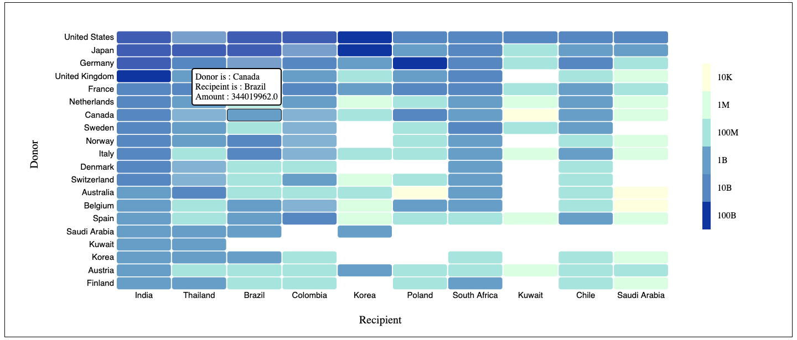
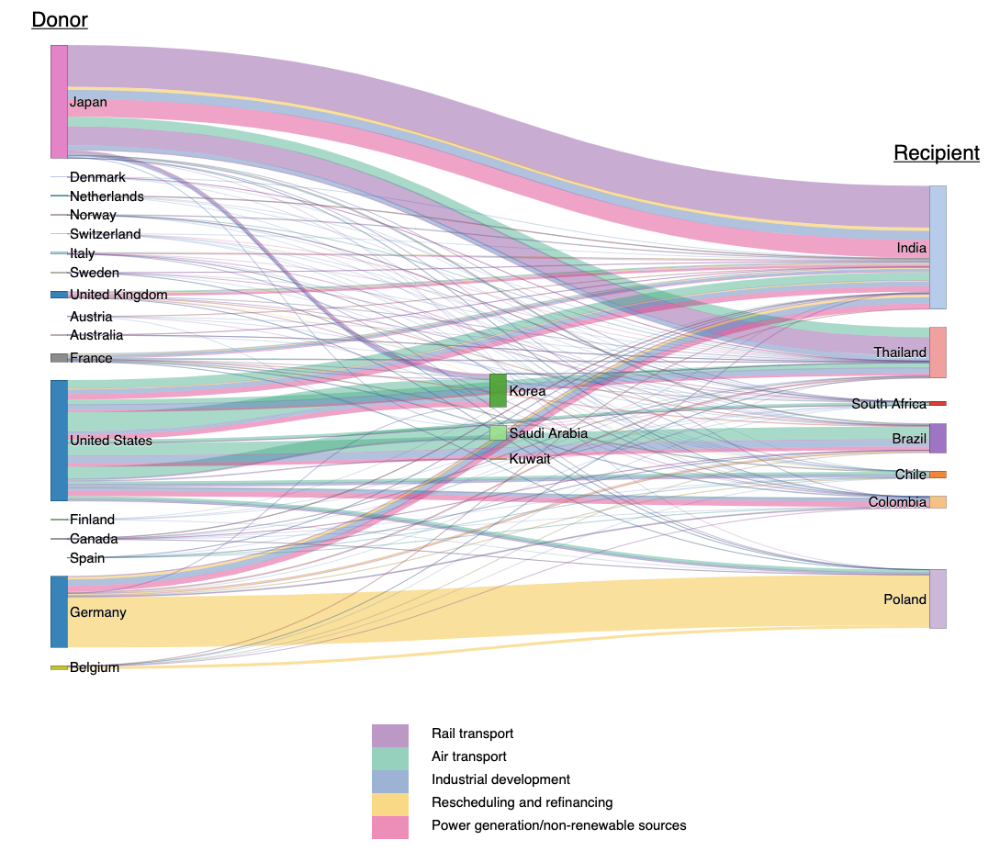

# DATA


### In the AidData dataset, each row represents a financial transaction between two countries. The dataset contains the following attributes:
1. Year: year of the commitment
2. Donor: country providing the financial resource
3. Recipient: country or organization receiving the money
4. Commitment Amount: the total amount of financial resources provided
5. Coalesced Purpose Name: the purpose of the transaction


Link to data - https://www.aiddata.org/data/aiddata-core-research-release-level-1-3-1

Note - have used reduced version of this dataset

# GOAL

## Create visualizations to answer the following questions :

**Visualization 1:**

Create an overview of the relationships between countries so that it is possible to see who donates to whom and how much. The main question one should be able to answer is: who are the major donors and to which countries do they donate the most and how much? And conversely, who are the major receivers and which countries do they receive from the most and how much? We only care about the top 10 recipients and the top 20 donors overtime for this question.

**Visualization 2:** 

Considering only the top 5 purposes of donation, how does the relationship between countries look like in terms of purposes? What purposes do countries donate to other countries? Are there countries that donate to a given country using multiple purposes? Or do counties always donate using one single purpose when donating to another country? The same as the previous question, we only care about the top 10 recipients and the top 20 donors here.


# Method

1. Preprocessing data in python using pandas and numpy
2. Using preprocessed data to create visulaizations in D3

#### Reason behind Visualizations and observations are in" Visualization_description.pdf"

# Visualization 1:



# Visualization 2:




```python

```
